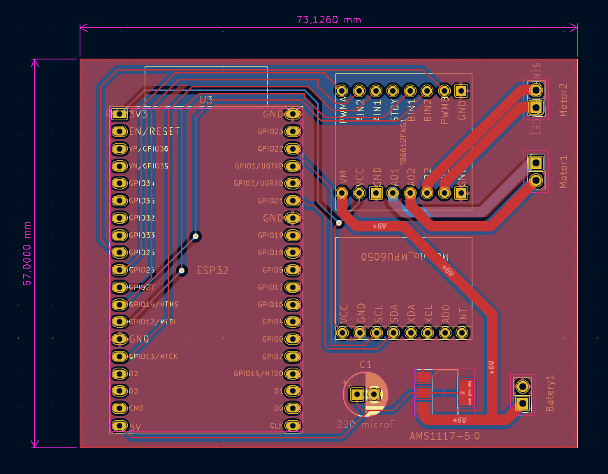
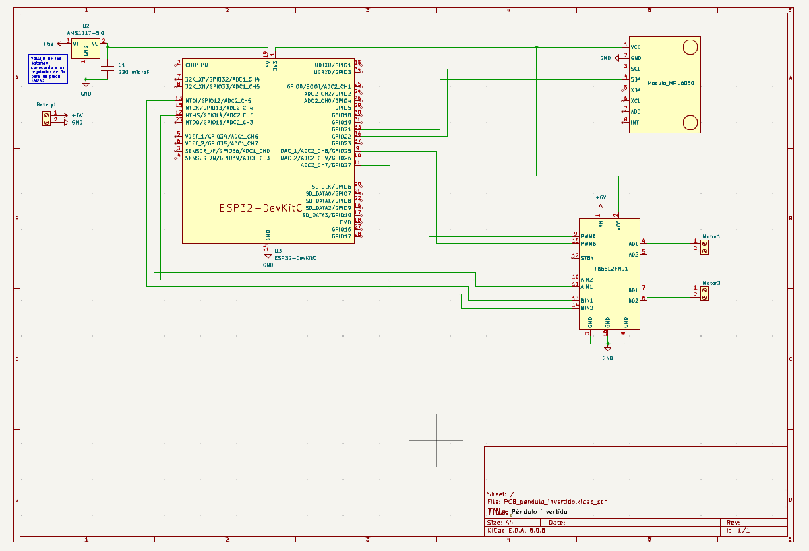
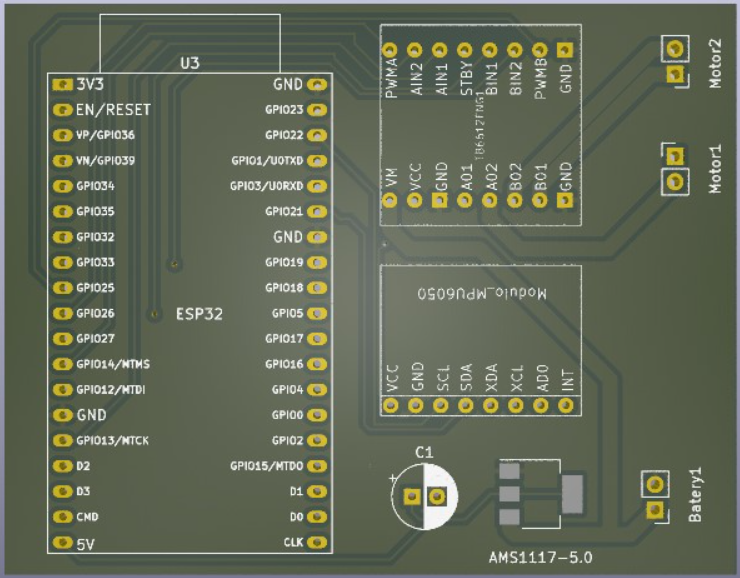

# Proyecto de Control PID Discreto y Péndulo Invertido

Este repositorio contiene el desarrollo de las prácticas de Teoría de Control, incluyendo el diseño y simulación de un controlador PID discreto, el diseño del sistema del péndulo invertido, el circuito de control, y su implementación embebida.

---

## 📂 Estructura del repositorio

- `Practica 4/` → Implementación en C++ de tres versiones del controlador PID discreto.
- `Diseño_plataforma_pendulo_invertido/` → Archivos FreeCAD, STL y G-code de la base para el péndulo.
- `PCB_pendulo_invertido/` → Diseño esquemático, footprint y vista 3D de la placa.
- `Librerias_MPU6050_I2Cdev/` → Librerías necesarias para el uso del sensor MPU6050 en el ESP32.

---

## 📚 Bibliografía

- [Microcontrolador ESP32-devKitC V4](https://docs.espressif.com/projects/esp-idf/en/latest/esp32/hw-reference/esp32/get-started-devkitc.html)
- [Giroscopio MPU6050](https://naylampmechatronics.com/blog/45_tutorial-mpu6050-acelerometro-y-giroscopio.html)
- [Driver TB6612FNG](https://www.luisllamas.es/arduino-motor-dc-tb6612fng)
- [Regulador AMS117 5V](https://datasheet.octopart.com/AMS1117-5.0-ams-datasheet-34441097.pdf)
- [Condensador para el regulador (220uF 16V)](https://c1555f5ec9.clvaw-cdnwnd.com/34662fcf1f1e607c561442431023ac8e/200000360-636e0646b8/Cap%20Electrolitic%2010-100V%20-%200.1%20to%2022000uF%20Datasheet.pdf)

---

## 📌 Diseño del PCB para el sistema de control del péndulo invertido

A continuación se muestran las tres vistas principales del circuito impreso desarrollado para controlar el sistema:

---

### 🖼️ 1. Vista enrutada del PCB

- Vista superior del diseño final del PCB enrutado.
- Incluye todas las pistas y pads para los componentes: ESP32, regulador, módulo MPU6050 y driver TB6612FNG.
- Las pistas de potencia (+6V) se han reforzado con trazado más ancho.

---

### 🖼️ 2. Esquemático eléctrico (KiCad)

- Representación del circuito completo.
- Conexiones entre los componentes principales, con referencia a pines de entrada/salida y alimentación.
- Refleja fielmente el diseño de la PCB.

---

### 🖼️ 3. Vista 3D de la PCB

- Representación tridimensional del PCB ensamblado.
- Permite verificar el espacio y la ubicación de los componentes antes de fabricación.
